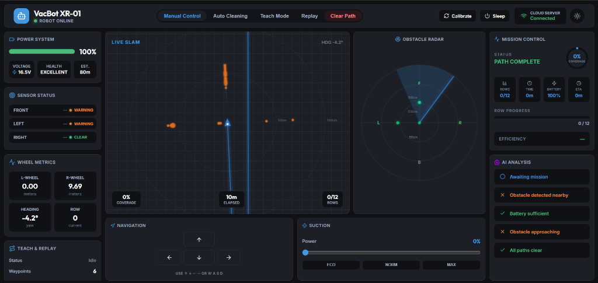

# 🤖 VacBot — Autonomous Vacuum Robot



Welcome to the VacBot project! This guide explains how to set up the hardware, flash the firmware, run the simulator, and use the web dashboard.

**Latest Updates (v2.1 - Commercial Grade Edition)**:
- 🌐 **Commercial Wi-Fi Provisioning (`WiFiManager`)**: Removed hardcoded Wi-Fi credentials. The robot now acts like a commercial smart-home product—if it loses connection, it broadcasts its own `VacBot-Setup` network for offline phone setup!
- ⚙️ **Dashboard Settings Modal**: A sleek new glass-morphism settings modal in the UI allows you to beam new Wi-Fi credentials to the robot instantly while it's running.
- 🏎️ **Dynamic Speed Control & Live Speedometer**: New `DriveControl` UI featuring an animated SVG speedometer that calculates real-time physical velocity in `cm/s` based on encoder feedback. Adjustable PWM slider for global speed control.
- 📡 **Over-The-Air (OTA) Updates**: You never need a USB cable again. The firmware can now be flashed completely wirelessly over your Wi-Fi network using the Arduino IDE Network Port.
- ⌨️ **Pro Keyboard Shortcuts**: Full hotkey support added: `TAB` cycles modes, `1,2,3` sets suction presets, `O` kills the vacuum, `M` toggles voice commands, `C` calibrates, and `Z` triggers sleep mode.
- 🔁 **Advanced TEACH & REPLAY Mode**: Completely overhauled waypoint recording using snapshot segments to eliminate dead-reckoning drift. Replay features micro-correction passes on turns.
- 🔋 **Smart Sleep Mode**: Suspends high-frequency polling and disables motors/LEDs. Auto-standby after 5 minutes of inactivity.

## Hardware Wiring

Here is the complete table of all 20 connections for the ESP32-S3 and peripherals:

| Component | ESP32-S3 Pin | Note |
| :--- | :--- | :--- |
| **Left Motor (PWM)** | GPIO 4 (`PIN_LEFT_ENA`) | To L298N ENA |
| **Left Motor (IN1)** | GPIO 5 (`PIN_LEFT_IN1`) | To L298N IN1 |
| **Left Motor (IN2)** | GPIO 6 (`PIN_LEFT_IN2`) | To L298N IN2 |
| **Right Motor (PWM)**| GPIO 7 (`PIN_RIGHT_ENB`) | To L298N ENB |
| **Right Motor (IN3)**| GPIO 15 (`PIN_RIGHT_IN3`) | To L298N IN3 |
| **Right Motor (IN4)**| GPIO 16 (`PIN_RIGHT_IN4`) | To L298N IN4 |
| **Left Encoder** | GPIO 17 (`PIN_ENC_LEFT`) | Left wheel pulse input |
| **Right Encoder** | GPIO 18 (`PIN_ENC_RIGHT`) | Right wheel pulse input |
| **Sonar Trigger** | GPIO 10 (`PIN_TRIG`) | Shared trigger for all 3 sonars |
| **Front Sonar Echo** | GPIO 11 (`PIN_ECHO_FRONT`) | Front ultrasonic sensor |
| **Left Sonar Echo** | GPIO 12 (`PIN_ECHO_LEFT`) | Left ultrasonic sensor |
| **Right Sonar Echo** | GPIO 13 (`PIN_ECHO_RIGHT`) | Right ultrasonic sensor |
| **Battery Voltage** | GPIO 20 (`PIN_BATTERY`) | To voltage divider |
| **Vacuum Motor (PWM)**| GPIO 38 (`PIN_VAC_PWM`) | To TB6612FNG PWMA+PWMB |
| **Vacuum Motor (IN1)**| GPIO 47 (`PIN_VAC_IN1`) | To TB6612FNG AIN1+BIN1 |
| **Vacuum Motor (IN2)**| GPIO 45 (`PIN_VAC_IN2`) | To TB6612FNG AIN2+BIN2 |
| **Status LED** | GPIO 48 (`RGB_PIN`) | Adafruit NeoPixel RGB LED |
| **MPU6050 SDA** | GPIO 8 (`PIN_SDA`) | I2C Data |
| **MPU6050 SCL** | GPIO 9 (`PIN_SCL`) | I2C Clock |

*Note: Ensure TB6612FNG STBY pin is tied to 3.3V so the motor driver is active.*

## Libraries to Install

You must install the following libraries via the Arduino IDE Library Manager:
- **PubSubClient** (by Nick O'Leary)
- **Adafruit MPU6050** (by Adafruit)
- **Adafruit Unified Sensor** (by Adafruit)
- **Adafruit NeoPixel** (by Adafruit)
- **ArduinoJson** (by Benoit Blanchon)
- **WiFiManager** (by tzapu) - *Required for the new Captive Portal Wi-Fi setup!*

## Step 1 — Flash Firmware

### Option A — PlatformIO (Recommended)

PlatformIO is pre-configured via `platformio.ini` at the project root. No code changes needed.

1. Install the **PlatformIO IDE** extension in VS Code (or install the CLI: `pip install platformio`).
2. Edit the `CONFIG` block at the top of `vacbot_firmware.ino` to set your `WIFI_SSID` and `WIFI_PASS`.
3. Open this folder in VS Code — PlatformIO will auto-detect `platformio.ini`.
4. Connect your ESP32-S3 via USB.
5. Click **Upload** (→ arrow) in the PlatformIO toolbar, or run from terminal:
   ```bash
   pio run --target upload
   ```
6. To open the Serial Monitor:
   ```bash
   pio device monitor
   ```

### Option B — Arduino IDE (Legacy / USB)

1. Open `Vacbot-Firmware.ino` in the Arduino IDE.
2. (No need to edit Wi-Fi credentials in the code anymore! They are handled by WiFiManager).
3. Under **Tools > Board**, select **ESP32S3 Dev Module**.
4. Set the **Upload Speed** to `921600`.
5. Connect your ESP32-S3 via USB and click **Upload**.

### Option C — Over-The-Air (OTA) Wireless Upload
Once you have flashed the firmware via USB for the very first time, you never need a cable again!
1. Ensure the robot is turned on and connected to the same Wi-Fi network as your computer.
2. Open the Arduino IDE.
3. Go to **Tools > Port** and look in the **Network Ports** section.
4. Select `VacBot-ESP32 at 192.168.x.x`.
5. Click **Upload**! (If prompted for a password, leave it blank).

## Step 2 — Initial Gyro Calibration

1. After flashing, place the robot on a completely flat surface and power it on.
2. The RGB LED will turn **BLUE** while connecting. 
3. **Keep the robot completely still for 3 seconds.** It actively takes 600+ samples to calculate the gyroscope bias.
4. Next, the robot will briefly spin left to detect the gyro orientation sign.
5. Once calibration is done and WiFi/MQTT connect successfully, the LED will turn **GREEN**.
6. *Note: You can recalibrate the robot at any time from the Web Dashboard by clicking the "Calibrate" button in the top right header.*

## Step 3 — Open Dashboard

1. Open the dashboard by navigating to the `dashboard-v2` folder and running `npm install` then `npm run dev` or `npm run build`.
2. For production, deploy the `dist/` folder to Vercel or open the built `index.html`.
3. The dashboard connects securely to HiveMQ using WebSockets. 

### Dashboard Layout

The dashboard is organized in a professional 3-column mission control layout:

**Desktop (1200px+)**:
- **Left Panel**: Battery status, sensor readings (Front/Left/Right ultrasonic), wheel encoder metrics, AI decision log.
- **Center Panel**: Real-time SLAM map visualization, 180° live sonar radar, Arrow navigation controls, and Vacuum sliders.
- **Right Panel**: Mission status, Teach & Replay tools, Mode selector, and heartbeat metrics.

**Tablet & Mobile**: Responsively stacks into a clean, smooth-scrolling single column layout. High-DPI canvas flickering is fully resolved for modern iPhones and Android devices!

### Dashboard Features

- **Commercial Wi-Fi Settings**: A sleek gear icon opens a blurred modal to beam new Wi-Fi credentials to the robot instantly.
- **Live Speedometer**: A car-style SVG dashboard gauge that calculates true physical velocity (cm/s) using differential encoder distance over time. Includes an adjustable PWM speed slider.
- **Pro Keyboard Shortcuts**: Drive with `WASD`/Arrows, tap `TAB` to quickly cycle modes (MANUAL->AUTO->TEACH->REPLAY), press `1/2/3` to snap suction to 30/60/100%, and `Z` to sleep.
- **Header System Controls**: Remote Sleep/Wake toggle button and Recalibration button!
- **Real-time SLAM Map**: Canvas visualization showing robot position, path history, obstacle positions, and movement trends.
- **Live Radar**: SVG 180° radar displaying front/left/right sensor distances with safe direction indicators.
- **Voice Commands**: Press `M` to activate your microphone and command the robot verbally ("Go forward", "Stop", "Turn left", "Sleep").
- **Teach & Replay Menu**: Easily record custom paths (waypoints) and trigger autonomous playback loops.
- **Battery Monitoring**: Live voltage, percentage, health status with color-coded alerts.

## MQTT Topic Reference

All communication happens under the `vacbot/` prefix:

| Topic | Direction | Payload Example | Description |
| :--- | :--- | :--- | :--- |
| `vacbot/cmd/movement` | ⬇️ Dash -> Robot | `FORWARD`, `STOP` | Manual drive commands |
| `vacbot/cmd/suction` | ⬇️ Dash -> Robot | `160`, `255` | 0-255 manual vacuum speed |
| `vacbot/cmd/speed` | ⬇️ Dash -> Robot | `150`, `255` | Global drive speed PWM setter |
| `vacbot/cmd/mode` | ⬇️ Dash -> Robot | `AUTO`, `MANUAL`, `SLEEP` | Mode toggle |
| `vacbot/cmd/system` | ⬇️ Dash -> Robot | `CALIBRATE`, `WIFI:ssid:pass`| System commands & Wi-Fi provisioning |
| `vacbot/status/battery` | ⬆️ Robot -> Dash | `{"voltage":"11.5","percent":85,"alert":false}` | Battery telemetry |
| `vacbot/status/distance` | ⬆️ Robot -> Dash | `{"cm":120,"obstacle":false}` | Front sonar distance |
| `vacbot/status/mode` | ⬆️ Robot -> Dash | `AUTO`, `SLEEP` | Mode confirmation |
| `vacbot/status/odometry` | ⬆️ Robot -> Dash | `{"yaw": 90, "left_cm": 20, "speed_cm_s": 45}` | Dead-reckoning & live velocity |
| `vacbot/status/teach` | ⬆️ Robot -> Dash | `{"recording":true,"waypoints":4}` | Teach state tracking |

## Firmware Features

### Intelligent TEACH & REPLAY System (v2.0)
- **Snapshot Recording**: Records exact distance and angle changes precisely at the moment the manual drive command is switched, removing the 100ms drift artifacts common in old polling logic.
- **Rate-Based PID Correction**: Replay calculates wheel difference over time, rather than cumulative wheel count. This stops the robot from permanently crippling one motor if it temporarily gets stuck on high-friction carpet.
- **Precision Turning**: Turns decelerate and apply micro-corrections (stopping 2 degrees early and pulsing the motors) to guarantee exact 90° or 180° rotations, solving the dead-reckoning drift!

### Enhanced Obstacle Detection
- **30ms Sonar Polling**: All 3 ultrasonic sensors (front/left/right) are read every 30ms for high-speed responsiveness.
- **MANUAL Mode Safety**: If front sonar detects an obstacle within `OBSTACLE_CM` (15cm), forward movement is immediately blocked to protect the chassis.
- **Predictive Avoidance**: If the robot approaches an obstacle quickly (<35cm), it triggers predictive turns toward the clearest side.

### Power Management & Standby
- **Auto-Sleep**: Robot goes into Standby Mode (`currentMode = SLEEP`) automatically after 5 minutes of manual idle time.
- **Hardware Suspension**: Standby cuts power to the NeoPixels, disables all PWM outputs to motor drivers, and skips the I2C Gyro/Sonar polling cycles to preserve the battery.
- **Optimized Voltage Threshold**: `BATTERY_MIN_V` set to 7.0V (was 9.0V), allowing extended runtime during high-power vacuum usage.

## Troubleshooting

- **Robot turns too much/little:** Ensure the wheels aren't slipping. Try using the new **Calibrate** button on the dashboard header while the robot is perfectly flat.
- **Motors crying on carpet:** We updated the torque constants to 255. Ensure your battery is fully charged.
- **MPU not found:** The LED will blink red. Check your I2C wiring on GPIO 8 (SDA) and 9 (SCL).
- **MQTT not connecting:** LED stays blue. Check your WiFi signal strength and ensure your SSID/Password are correct. For TLS certificate issues, the firmware falls back to insecure mode automatically.
- **Dashboard UI Crashing on Mobile:** Make sure you've built the latest `v2.0` dashboard code, which includes the `devicePixelRatio` fix for the Canvas SLAM visualizer.

## Changelog

### v2.1 (Commercial Grade Edition)
- **Integrated WiFiManager**: Implemented a captive portal (`VacBot-Setup`) fallback for offline network configuration.
- **Dashboard Wi-Fi Provisioning**: Added a dynamic React modal to push Wi-Fi updates via MQTT without relying on hardcoded C++ macros.
- **Live Speedometer**: `T_STAT_ODOMETRY` now calculates and broadcasts real physical velocity (`cm/s`) based on encoder deltas.
- **Global Speed Control**: Added UI PWM slider and backend integration to scale wheel velocity on the fly.
- **Pro Keyboard Shortcuts**: Added `TAB` mode cycling and 1-2-3 suction preset shortcuts.
- **Over-The-Air (OTA) Flashing**: Enabled ArduinoOTA for completely wireless firmware updates.

### v2.0
- Complete overhaul of TEACH/REPLAY snapshot logic.
- Added intelligent PID rate-correction for straight-line replay drift.
- Added micro-correction passes for precision turning.
- Implemented global `SLEEP` state with 5-minute Auto-Standby timer.
- Added remote `CALIBRATE` system command via MQTT.
- Fixed critical Canvas rendering loop crash on Mobile Webkit browsers.
- Re-architected Dashboard Header with explicit power and calibration buttons.

### v1.1
- Reduced sonar polling interval from 100ms → 30ms for real-time obstacle detection.
- Added `checkObstaclesWhileMoving()` for continuous safety monitoring.
- BATTERY_MIN_V threshold adjusted from 9.0V → 7.0V to support extended peak load.
- Added Side-by-side dashboard layout for desktop and resolved CSS overflow issues.

### v1.0 (Initial Release)
- Autonomous vacuum robot firmware with WiFi + MQTT connectivity.
- 3x ultrasonic sensor obstacle detection and avoidance.
- Real-time SLAM map visualization on React dashboard.
- Dual H-bridge motor control with encoder feedback.
- MPU6050 gyroscope-based heading tracking.
